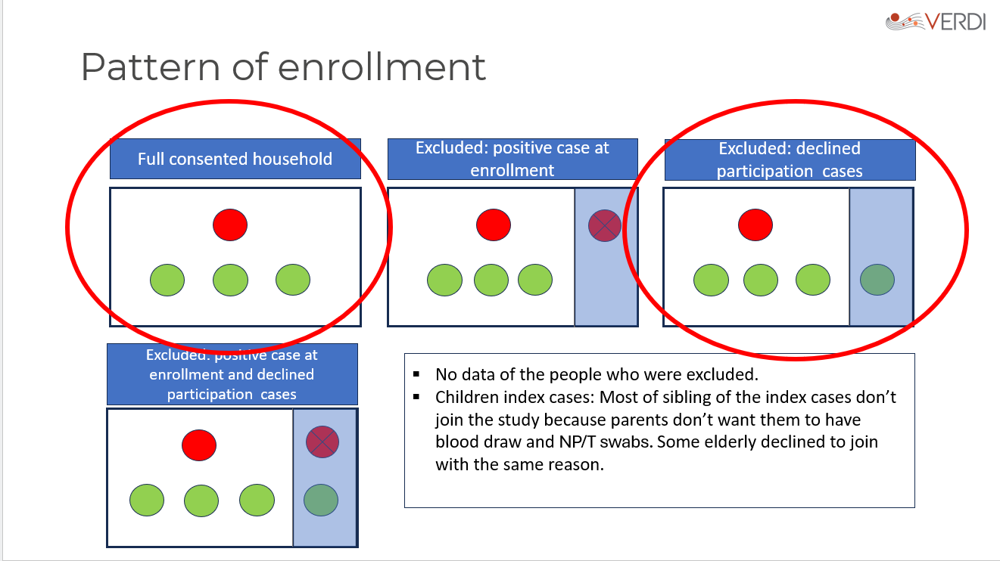

# Overview

The aim of this is model to correct the **household SAR ** by including missing members. 

------------------------------------------------------------------------


# Patterns of enrollment

{fig-align="center" width="80%"}

This are the 4 patterns of enrollment at origin. In modeling study, we only consider the Full participation household and the declined participation cases (the one circled in red). If there is a positive contact case at entry, we exclude it.

# Our data
let's have a look at the contact cases that were positive at enrollment. When filter, We end up with 80 households.


```{r}
#| include: false

library(dplyr)
library(ggplot2)

source("R/model_functions_simple.R")

set.seed(2024)


pcr_result <- read.csv("/mnt/d/VERDI/metadata/res/pre_process/raw_data/pcr_result.csv")
pcr_pos_day1 <- pcr_result %>%
  mutate(index = as.integer(endsWith(pid, "1")),
         hhid  = as.integer(substr(pid, 3, 5))) %>%
  filter(visit == "Day1", result == "Detected", valid==1, index==0) %>%
  select(pid, hhid)

#print(pcr_pos_day1)
#'''15 contacts were positive at enrollement, from 14 households. We need to exclude this families from the #analysis, because we cannot know if the secondary cases were infected by the index case or by the contact who #was already positive at enrollment. '''
```

```{r}
#| include: false

TAU      <- 2    # index pre-enrollment infectious days; sensitivity: 1, 3

dataset <- read.csv("/mnt/e/VERDI_modeling/data/dataset_freezed2Nov25.csv") %>%
  mutate(
    infected_bin = as.integer(result_infected == "Detected")
  ) %>%
  group_by(hhid) %>%
  mutate(exclude_mem = exclude_mem[index == 1][1]) %>%
  ungroup()

hh_list <- build_hh_list_simple(dataset, tau = TAU)

n_obs_contacts  <- sum(sapply(hh_list, function(h) nrow(h$contacts)))
n_obs_infected <- sum(sapply(hh_list, function(h) sum(h$contacts$infected_bin)))
n_total_missing <- sum(sapply(hh_list, function(h) h$n_missing))  

dataset_filtered <- dataset %>%
  filter(!(hhid %in% pcr_pos_day1$hhid)) 

hh_list_f <- build_hh_list_simple(dataset_filtered, tau = TAU)

n_obs_contacts_f  <- sum(sapply(hh_list_f, function(h) nrow(h$contacts)))
n_obs_infected_f  <- sum(sapply(hh_list_f, function(h) sum(h$contacts$infected_bin)))
n_total_missing_f <- sum(sapply(hh_list_f, function(h) h$n_missing))


```

```{r}
#| echo: false
comparison <- data.frame(
  Metric = c("Households", "Observed contacts", "Observed infected",
             "Raw SAR (%)", "Missing members"),
  Before = c(length(hh_list),
             n_obs_contacts,
             n_obs_infected,
             sprintf("%.1f", 100 * n_obs_infected / n_obs_contacts),
             n_total_missing),
  After  = c(length(hh_list_f),
             n_obs_contacts_f,
             n_obs_infected_f,
             sprintf("%.1f", 100 * n_obs_infected_f / n_obs_contacts_f),
             n_total_missing_f)
)

knitr::kable(comparison,
             col.names = c("", "All households", "PCR-negative at entry"),
             caption   = "Effect of excluding households with a contact PCR-positive at enrollment.")
rm(hh_list)
rm(dataset)
rm(n_obs_contacts)
rm(n_obs_infected)
rm(n_total_missing)
```

------------------------------------------------------------------------

# The useful variables we have 

- **timetoinf**: Contacts self-administered an antigen RDT (Flowflex ATK) every other day for 14 days. When the ATK was positive, the study team visited the household and collected a nasopharyngeal swab for RT-PCR on the same day as the positive ATK. the variable **timetoinf** records the day of first positive ATK, with PCR confirmation on that same day.
- **excludemem** : the number of excluded members (not observed)

# Person-to-person hazard of infection in the household


In [**Tsang et al.** model](https://pmc.ncbi.nlm.nih.gov/articles/PMC9991055/), the hazard of infection of individual $j$ at time $t$ from an infected household member $i$ (who has a latent detection/infection time $T_{hi}$) in household $h$ is formulated as:

$$\lambda_{i \to j}(t) = \frac{\lambda_h}{X_{k}^{\beta}} \cdot \exp(\delta_i) \cdot f(t - T_{hi})$$

Where:
* $\lambda_h$: The baseline  transmission hazard rate.
* $\beta$:  relationship between number of household contacts and transmission rate
* $X_{k}$:  the number of household contacts
* $\delta_i$: relative individual infectiousness of cases
* $f(·)$: the infectiousness profile


In this first model, we assume that there are no individual differences in susceptibility or infectiousness, and that all household members have the same rates of contact with each other (homogeneous mixing). So we consider β and δi equal to 1, hence the hazard of infection of individual $j$ at time $t$ from an infected household member $i$ in household $h$ is formulated as : 
* $$\lambda_{i \to j}(t) = \lambda_h \cdot f(t - t_i + 1)$$

where:
* $\lambda_h$: The baseline  transmission hazard rate.
* $t_i$: The PCR positive date 
* $f(·)$: the serial interval

## 1. Serial Interval (Omicron Gamma) 
::: {.callout-note title="Questions"}
- Is the distribution of time between two consecutive PCR positive dates  an operational proxy for the serial interval ?
- Should I use the genomic data to get the index strain, and choose an appropriate serial interval according to the strain for each household ?
::: 


In [Tsang et al. (2023)](https://pmc.ncbi.nlm.nih.gov/articles/PMC9991055/),  the infectiousness profile since infection is generated from the assumed incubation period (mean equal to 5 days) and infectious period (mean equal to 13).

* The real issue for us is that **timetoinf** is the ATK detection day of the contact, not the transmission day (followed by a PCR confirmation the same day). The distribution of time between two consecutive PCR positive dates is an operational proxy for the serial interval (Please correct me if I am wrong). [Cauchemez and al 2009](https://pubmed.ncbi.nlm.nih.gov/20042753/) uses the serial interval in the hazard of infection model. As prior, I will use the probabilistic density of the serial interval.

* At the moment, I use the Serial Interval from  bibliography [an der Heiden et al, 2022](https://pmc.ncbi.nlm.nih.gov/articles/PMC9530378/), based on 11 512 household clusters during the Omicron Period in Germany. We model the Serial Interval $f(t)$ as a discretized Gamma distribution, with **$shape = 2.11$ and $rate=0.50$.** 

*  $\tau$: `timetoinf` is measured from enrollment, not from the index case's first infectious day. We fixed $\tau$ as the number of days the index case was already infectious before enrollment, fixed at $\tau$ = 2 as the primary estimate (based on the study's 48-hour enrollment criterion ).

-   For the **index case** at follow-up day $t$: infectious day = $\tau + t$, so weight = $f(\tau + t)$.

-   For a **secondary infector** infected on day $t_j$: on day $t$ they are at infectious day $t - t_j + 1$, so weight = $f(t - t_j + 1)$.


```{r}
#| echo: false

shape  <- 2.11
rate   <- 0.50

D_max  <- 14
f_raw  <- diff(pgamma(0:D_max, shape = shape, rate = rate))
f_prof <- f_raw / sum(f_raw)

plot((1:D_max) - 0.5, f_prof, type = "h",
     xlab = "Days since infection", ylab = "Relative infectiousness",
     main = "Omicron serial interval (Gamma, shape = 2.11, rate = 0.50)",
     lwd = 2, col = "steelblue",
     xlim = c(0, D_max), ylim = c(0, max(f_prof) * 1.1))
x_seq <- seq(0, D_max, length.out = 500)
y_seq <- dgamma(x_seq, shape = shape, rate = rate) / sum(f_raw)
lines(x_seq, y_seq, col = "#E63946", lwd = 2)
legend("topright",
       legend = c("Daily probability mass f(t)", "Continuous Gamma density"),
       col = c("steelblue", "#E63946"), lwd = c(2, 2), bty = "n", cex = 0.9)
```


## Our Person-to-person hazard of infection

In this first model, we consider homogeneous mixing, so we simplify the equation from [Tsang et al](https://pmc.ncbi.nlm.nih.gov/articles/PMC9991055/), to go to this : 

|  |
|:---|
|  |
| The hazard that an infectious household member $i$ (with infection day $t_i$) transmits to a susceptible member $j$ on study day $t$ is: |
| $$\lambda_{i \to j}(t) = \lambda_h \cdot f(t - t_i + 1)$$ |
| where: |
| \- $\lambda_h$ is the **baseline household transmission rate** : hazard of infection from an infected household member (Tsang et al., 2023), interpreted as the per-contact-per-day probability of infection. - $f(\cdot)$ is the **Serial Interval**, a discretised Gamma distribution ($shape = 2.11$ days, $rate = 0.5$ days)


## How to handle missing household members?

Non-enrolled ("missing") household members are treated as latent variables : we never observe them, but we impute their infection status probabilistically within the MCMC.  `n_missing = exclude_mem` gives their count per household.
Because we do not model age here, the prior is the same for all missing members in a given household.

For every $k$ missing members in household $h$, we assign two latents variables : $Y_{hk}$ and $T_{hk}$. 

If missing member $k$ has $Y_{hk} = 1$ (infected), then at follow-up day $t$ they contribute hazard to every other susceptible in the household.

$T_{hk}$ is the unobserved detection day. Assigning $T_{hk}$ is also important, because a missing member who was infected can themselves infect another susceptible household member $i$, with the hazard $\lambda_h \cdot f(t - T_{hk} + 1)$: 

$\lambda_i(t) \ni \lambda_h \cdot f(t - T_{hk} + 1)$

#### How to initialize $Y_{hk}$ ?
::: {.callout-note title="Questions"}
- Should I choose the observed SAR as prior ?
- Should I choose a bigger prior to help the chain explore the space ?
::: 

Each missing member starts infected with 20%, which is around the observed SAR: $Y_{hk}^{(0)}$ $\text{Bernoulli}(0.2)$

#### How to initialize $T_{hk}$ ?
::: {.callout-note title="Questions"}
- As a prior for the missing time, should I use a Omicron serial interval distribution, or the observed distribution from the infection enrolled contacts ? 
:::

We can use the existing timetoinf form infected enrolled contacts as a prior for the missing time of postive PCR test of the missing members.
```{r}
#| echo: false
#| fig-cap: "Distribution of observed infection times (timetoinf) among infected enrolled contacts."

library(ggplot2)
timetoinf_obs <- unlist(lapply(hh_list_f, function(h) {
  h$contacts$timetoinf[h$contacts$infected_bin == 1L & !is.na(h$contacts$timetoinf)]
}))

ggplot(data.frame(t = timetoinf_obs), aes(x = t)) +
  geom_histogram(binwidth = 1, fill = "#457B9D", alpha = 0.85, colour = "white") +
  scale_x_continuous(breaks = 1:14) +
  labs(x = "Days from enrollment to first positive PCR (timetoinf)",
       y = "Count",
       title = "Observed infection timing among enrolled contacts") +
  theme_minimal(base_size = 13)
```


#### Gibbs steps for $Y_{hk}$ and $T_{hk}$

$Y_{hk}$ and $T_{hk}$ are updated **jointly** with 0ne Gibbs Step. 

For each missing member, we  enumerate all 15 ($T_\text{follow} + 1$) mutually exclusive states : "not infected", or "infected on day $t$" for every $t = 1, \ldots, T_\text{follow}$.  Each state is scored  by its household log-likelihood (`hh_loglik_timed_simple`) plus its log-prior weight from `prior_miss_simple`. A single state  $(Y_{hk}, T_{hk})$is drawn from the resulting categorical distribution of the 15 states. 


# 3 Transmission model
::: {.callout-note title="Questions"}
- What value should I pick for $p_\text{bg}$ ?
:::

Each susceptible contact faces a **daily hazard** from four sources:

1. The **index case** , weighted by $f(\tau + t)$
2. **Enrolled contacts** who tested positive on day $t_j$ , weighted by $f(t - t_j + 1)$
3. **Missing members** with latent infection day $T_{hk}$ , weighted by $f(t - T_{hk} + 1)$
4. **Community background** $\lambda_c$ ( $-log( 1 - p_\text{bg})$  day, $p_\text{bg}$: 0.003/day)
    $p_\text{bg}$, being the probability of getting infected by the community each day.

In this model, A missing member with $Y_{hk} = 1$ and $T_{hk} = 5$ contributes exactly the same hazard as an enrolled contact who tested positive on day 5.

The daily force of infection on susceptible $i$ at day $t$ is:

|  |
|:---|
| $$\lambda_i(t) = \lambda_c
               + \lambda_h\, f(\tau + t)
               + \sum_{j:\,\text{infector}} \lambda_h\, f(t - t_j + 1)$$ |


# What are all the transmission chains modelled?

| Direction | Modelled? | Where |
|---|---|---|
| Index → enrolled contact | Yes | likelihood |
| Index → missing member | Yes | prior  |
| Enrolled contact → enrolled contact | Yes | likelihood  |
| Enrolled contact → missing member | Yes | prior  |
| Missing member → enrolled contact | Yes | likelihood  |
| Missing member → missing member | No |  not implemented |

# Inference


## Likelihood 

The Likelihood function is similar to the one used in [Tsang et al, 2023](https://pmc.ncbi.nlm.nih.gov/articles/PMC9991055/) and [Cauchemez et al., 2009](https://pubmed.ncbi.nlm.nih.gov/20042753/).

The cumulative escape probability for susceptible $i$ through day $t_i$ is:
$$E_i(t_i) = \exp\!\left(-\sum_{t=1}^{t_i} \lambda_i(t)\right)$$

The probability that household member $i$ has PCR detected on day $t_i$ is the probability of not getting PCR detected until day $t_i-1$, then getting PCR detected on day $t_i$.  : 
$$P(y_i = 1, t = t_{i}) = \left[1 - \exp(-\lambda_i(t_{i}))\right] \times E_i(t_i - 1) =  \left[1 - \exp(-\lambda_i(t_{i}))\right] \times \exp\left(-\sum_{t=1}^{t_{i}-1} \lambda_i(t)\right)$$


For a contact infected on day $t_i$, Two things must have happened:

1. They survived days 1 through $t_i - 1$ (not infected before day $t_i$).
2. They did NOT survive day $t_i$  (infected on exactly day $t_i$).
So the probability of a contact being infected on day $t_i$: 
$$\mathcal{L}_i = P(\text{survived through day } t_i - 1) - P(\text{survived through day } t_i)$$

$$= E_i(t_i - 1) - E_i(t_i)$$

This is the **discrete probability mass** of being infected on exactly day $t_i$.


- If infected on day 4:  L_i = E_i(3) - E_i(4) = 0.79 - 0.71 = 0.08
- If not infected:       L_i = E_i(14).
The larger the drop on day $t_i$, the higher the hazard on that day.


------------------------------------------------------------------------


# 5. MCMC sampler
::: {.callout-note title="Questions"}
- Should I use a Uniform or a Gamma;log(normal) distribution for $\lambda_h$ ?
- What $\lambda_h$ initialization value should I take ?
- What $\lambda_h$ SD initialization value should I take (0.015 at the moment) ?  
::: 

- we take a $\lambda_h$ initialization value of 0.02 .
- We used Uniform(0,1) as prior for $\lambda_h$, similar to the prior used by Cauchemez et al. and [Tsang et al.](https://pmc.ncbi.nlm.nih.gov/articles/PMC9991055/)
- The SD of the Gaussian random-walk proposal is 0.015.

- Two update components per iteration:

1.  **MH for** $\lambda_h$ : random-walk on $\lambda_h$ ; Uniform(0,1)
2.  **Gibbs for** ${T_{hk},Y_{hk}}$ 

# MCMC sampler

## Setup
```{r}
#| output: false


# MCMC settings
N_ITER   <- 20000
N_BURNIN <- 5000
N_THIN   <- 10
LAMBDA_H_INIT <- 0.02
LAMBDA_H_SD <- 0.015

# Fixed biological parameters (Omicron)
T_FOLLOW <- 14   # observation window (days)
TAU      <- 2    # index pre-enrollment infectious days; sensitivity: 1, 3

# Background daily community acquisition probability
P_BG <- 0.003

```


## Run MCMC
```{r}
#| include: false
cache_file <- "results/mcmc_simple.rds"

if (file.exists(cache_file)) {
  res <- readRDS(cache_file)
  cat("Loaded cached results.\n")
} else {
  res <- run_mcmc_simple(hh_list_f,
                         n_iter   = N_ITER,
                         n_burnin = N_BURNIN,
                         n_thin   = N_THIN,
                         q_init = LAMBDA_H_INIT,
                         q_sd = LAMBDA_H_SD,
                         f_prof   = f_prof,
                         p_bg     = P_BG,
                         T_follow = T_FOLLOW)
  saveRDS(res, cache_file)
}

all_q     <- res$q_chain
all_E_inf <- res$E_miss_infected

```

##  Results

### Posterior of $\lambda_h$

```{r}
#| echo: false
q_summary <- data.frame(
  median = median(all_q),
  lower  = quantile(all_q, 0.025),
  upper  = quantile(all_q, 0.975)
)

cat(sprintf("lambda_h: median = %.4f  (95%% CrI: %.4f – %.4f)\n",
            q_summary$median, q_summary$lower, q_summary$upper))

ggplot(data.frame(q = all_q), aes(x = q)) +
  geom_histogram(bins = 60, fill = "#457B9D", alpha = 0.85) +
  geom_vline(xintercept = q_summary$median, colour = "#E63946", linewidth = 0.8) +
  labs(title = "Posterior distribution of lambda_h (age-homogeneous model)",
       x = "lambda_h (per-contact-per-day transmission probability)", y = "Count") +
  theme_minimal(base_size = 13)
```

## Corrected SAR

```{r}
#| echo: false
#| 
sar_corrected <- (n_obs_infected_f + all_E_inf) /
                 (n_obs_contacts_f  + n_total_missing_f)
sar_obs <- n_obs_infected_f / n_obs_contacts_f

sar_summary <- data.frame(
  Analysis = c("Published GEE (Khamduang et al. 2026)",
               "Observed enrolled only",
               "Corrected (age-homogeneous chain-binomial)"),
  SAR_pct  = c(23.5,
               round(sar_obs * 100, 1),
               round(median(sar_corrected) * 100, 1)),
  Lower    = c(NA_real_,
               round((sar_obs - 1.96 * sqrt(sar_obs * (1 - sar_obs) /
                                              n_obs_contacts_f)) * 100, 1),
               round(quantile(sar_corrected, 0.025) * 100, 1)),
  Upper    = c(NA_real_,
               round((sar_obs + 1.96 * sqrt(sar_obs * (1 - sar_obs) /
                                              n_obs_contacts_f)) * 100, 1),
               round(quantile(sar_corrected, 0.975) * 100, 1))
)

knitr::kable(sar_summary,
             col.names = c("Analysis", "SAR (%)", "95% lower", "95% upper"),
             caption   = "Individual-level SAR estimates.")
```

```{r}
#| echo: false
ggplot(data.frame(sar = sar_corrected * 100), aes(x = sar)) +
  geom_histogram(bins = 50, fill = "#457B9D", alpha = 0.85) +
  geom_vline(xintercept = sar_obs * 100,
             colour = "#E63946", linetype = "dashed", linewidth = 0.8) +
  geom_vline(xintercept = median(sar_corrected) * 100,
             colour = "#2a9d8f", linewidth = 0.8) +
  annotate("text", x = sar_obs * 100, y = Inf, vjust = 2, hjust = -0.1,
           label = sprintf("Observed %.1f%%", sar_obs * 100),
           colour = "#E63946", size = 3.5) +
  annotate("text", x = median(sar_corrected) * 100, y = Inf, vjust = 2, hjust = 1.1,
           label = sprintf("Corrected %.1f%%", median(sar_corrected) * 100),
           colour = "#2a9d8f", size = 3.5) +
  labs(title    = "Posterior distribution of corrected SAR",
       subtitle = "Uncertainty from joint posterior of (lambda_h, Y_hk, T_hk)",
       x = "Individual-level SAR (%)", y = "Count") +
  theme_minimal(base_size = 13)
```

## Expected infections among missing members

```{r}
#| echo: false
cat(sprintf(
  "Expected infections among %d missing members: %.1f  (95%% CrI: %.1f – %.1f)\n",
  n_total_missing_f,
  median(all_E_inf),
  quantile(all_E_inf, 0.025),
  quantile(all_E_inf, 0.975)
))
```

------------------------------------------------------------------------

# 8. Convergence diagnostics

```{r}
#| echo: false
plot(seq_along(all_q) * N_THIN, all_q, type = "l", col = "#457B9D",
     xlab = "Iteration (post-burnin)", ylab = "lambda_h",
     main = "Trace plot , lambda_h (age-homogeneous model)")

cat(sprintf("lambda_h, median: %.3f  95%% CrI: [%.3f, %.3f]\n",
  median(all_q),
  quantile(all_q, 0.025),
  quantile(all_q, 0.975)))


n_eff <- function(x) {
  n  <- length(x)
  ac <- acf(x, lag.max = 100, plot = FALSE)$acf[-1]
  n / (1 + 2 * sum(ac[ac > 0.05]))
}
cat(sprintf("ESS , lambda_h: %.0f\n", n_eff(all_q)))
```


lambda_h is not converging, ESS is still low. Need to change parameter values, or the way missing members are integrated.

# Sensitivity analysis: hypergeometric

 A package named "chainbinomial" was developped with the paper  [Lindstrøm et al. (2024)](https://arxiv.org/pdf/2403.03948). This package contains tools for analyzing data using the Chain Binomial model and estimating the transmission probability. The household transmission probability is defined as the probability that an infected household member infects a susceptible household member.

One of the tools developped by Lindstrøm, is to take into account unobserved individuals in households.
"ometimes there are individuals in the household whose infection status is not known. This could be because they did not get tested, did not consent to participate in the study or were excluded for some other reason. These individuals will still contribute to the outbreak dynamics within the household and their presence ought to be modelled and not ignored, even if their infection status is unknown.

One way to deal with this is to assume an underlying chain binomial model of the outbreak, and have a hypergeometric observational model on top of that. The probability of observing x infected in a household of 5 initial susceptible individuals, where only 4 of them are observed (i.e. 1 individual is not observed) can be calculated with the **dcbhyper function**, using the s0_obs argument."

```{r}
#| include: false
library("chainbinomial")
source("R/hyperchainbinom.R")
dcbhyper(x=0:4, s0 = 5, prob = 0.25, s0_obs = 4, i0 = 1)

estimate_sar_cbhyper(infected= 1, s0 = 5, s0_obs = 4, i0 = 1, se = TRUE)
```

Let's try on all our households. The `estimate_sar_cbhyper` function takes vectors of observed infections, total household size, observed household size, and initial infectors, and returns the estimated SAR with confidence intervals.
i0 is the number of initial infectors (index case) in each household. In our dataset, it is always 1.

```{r}
hyper_sar <- estimate_sar_cbhyper(
  infected = sapply(hh_list_f, function(h) sum(h$contacts$infected_bin)),
  s0       = sapply(hh_list_f, function(h) nrow(h$contacts) + h$n_missing),
  s0_obs   = sapply(hh_list_f, function(h) nrow(h$contacts)),
  i0       = 1
)
print(hyper_sar$sar_hat)
```

```{r}
#| echo: false
hyper_ci <- confint.sar2(hyper_sar)

sar_summary_full <- rbind(
  sar_summary,
  data.frame(
    Analysis = "Hypergeometric chain-binomial (chainbinomial pkg)",
    SAR_pct  = round(hyper_sar$sar_hat * 100, 1),
    Lower    = round(hyper_ci[1] * 100, 1),
    Upper    = round(hyper_ci[2] * 100, 1)
  )
)

knitr::kable(sar_summary_full,
             col.names = c("Analysis", "SAR (%)", "95% lower", "95% upper"),
             caption   = "Table 3: Individual-level SAR estimates across methods.")
```

------------------------------------------------------------------------


# 5. Sensitivity analysis: take age of contacts into account

- **Consider the household contact heterogeneity**:  Uses the Prem et al. (2021) Thai home contact matrix to weight the per-contact-per-day transmission probability $q$ by the age of the infector and infectee. the age-stratified version  multiplies each $\lambda_h$ term by $C_{a_i, a_j}$ from the Thai home contact matrix (Prem et al. 2021).

- **Consider the community contact heterogeneity**: Take into account the community contact based on the age 

------------------------------------------------------------------------

# Model assumptions and limitations

| Assumption | Impact if violated |
|----|----|
| $\tau = 2$ days (index pre-enrollment infectious period) | Shifts timing window for index→contact transmission; sensitivity at $\tau \in \{1, 3\}$ |
| Homogeneous $\lambda_h$ with no age-stratified contact rates | Underestimates child–adult differential; the age-stratified model with the Prem et al. (2021) matrix  is a planned sensitivity extension |
| Fixed $p_\text{bg} = 0.003$/day | Community hazard varied over 2022–2024; sensitivity warranted |
| MCAR missingness | If refusal correlates with infection status, corrected SAR is biased |
